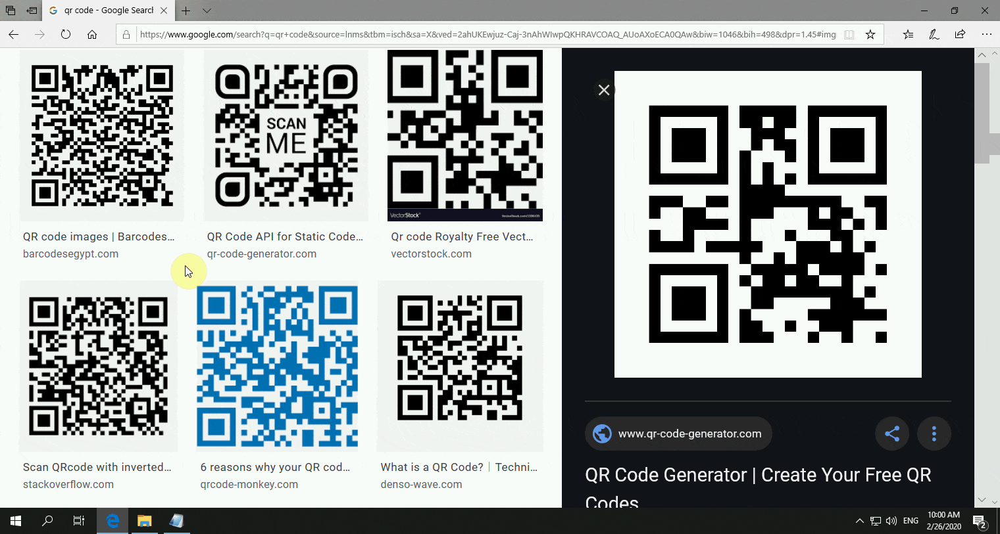

## Intro

**Screen QR code scanning utility for Windows.**

Driven by two engines, QRUtil now has the following functionalities:

### Auto detection

Under this mode, QRUtil supports detecting multiple QR codes on the screen simultaneously.

### Manual detection

Using a strong and fast engine recently open-sourced by Tencent's team WeChatCV, QRUtil supports detecting a manual selected range, as an supplement to auto-detection.

## Rec



## Release

Please refer to the [*release*](https://github.com/yype/QRUtil/releases) page.

## Configuration

Color scheme and key bindings can be configured via a json formatted config file:

```shell
./QRUtil [config_filename] (default: ./config.json).
```

**Example**

```jsonc
// -- default configuration file with default settings --
// QRUtil will fall back to the internal hard-coded config upon parsing failure on this file
{
    "COLOR":{ // The color format is AARRGGBB in hexadecimal form
       "DARK_COVER":"46000000", // A dark color that covers the entire screen
       "AUTO_QR_BOARDER":"FF007ACC", // Border color of the QR boxes (AUTO MODE)
       "BOARDER_THICKNESS":2.0, 
       "AUTO_QR_NO_HOVER":"1E007ACC", // Color of the QR boxes when not under hover (AUTO MODE)
       "AUTO_QR_HOVER":"64007ACC",
       "AUTO_QR_SELECT": "7DF5B84C", // Color of the QR boxes when selected (AUTO MODE)
       "QR_TEXT_BACKGROUND":"50000000", // Color of the background for the decoded hint text
       "QR_TEXT_COLOR":"FFFFFFFF", // Color of the decoded hint text
       "MANUAL_OK_COLOR": "80699C52", // Color of the selected range when successfully detected (MANUAL MODE)
       "MANUAL_NOT_OK_COLOR": "80DD5145", 
       "MANUAL_QR_BORDER": "FF007ACC", // Color of the selected range's border (MANUAL MODE)
       "MANUAL_SELECT_FILL":"1E007ACC", // Color of the selected range when still selecting (MANUAL MODE)
       "MODE_TEXT_COLOR":"80FFFFFF" // Color of the text color for the mode text (i.e. `MANUAL MODE` or `AUTO MODE`)
    },
    "HOTKEY":{ // hot key for capturing QR codes
       "CTRL":true,
       "ALT":true,
       "SHIFT":true,
       "VKEY":"I" // https://docs.microsoft.com/windows/desktop/inputdev/virtual-key-codes
    },
    "KEY":{ // define the function of keys pressed on the capture screen
       "SELECT_ALL":"A", // KEYs are not case-sensitive
       "DESELECT_ALL":"D",
       "COPY_SELECTED":"C",
       "SWITCH_MODE":"Z",
       "EXIT_PROGRAM": "71" // hexidecimal form of the virtual key code, in this case 0x71(F2)
    },
    "DEFAULT_MODE": "MANUAL" // `MANUAL` or `AUTO`
 }
```

## Build

**Install Dependencies**

- [opencv-4.2.0-vc15](https://sourceforge.net/projects/opencvlibrary/files/4.2.0/opencv-4.2.0-vc14_vc15.exe/download)
- [zbar-0.10-windows-installer](http://sourceforge.net/projects/zbar/files/zbar/0.10/zbar-0.10-setup.exe/download)
- [jsoncpp](https://github.com/open-source-parsers/jsoncpp)
- Build [wechat_qrcode](https://github.com/opencv/opencv_contrib/tree/master/modules/wechat_qrcode) extra module for opencv

Reference build command for wechat_qrcode:

``` 
proxychains cmake -DCMAKE_BUILD_TYPE=Release -DBUILD_LIST="wechat_qrcode" -DOPENCV_EXTRA_MODULES_PATH=PATH_TO\opencv_contrib\modules PATH_TO_OPENCV/sources
cmake --build . --config Release
```

**Set Environment Variables**

- OPENCV_DIR to ...\build\x64\vc15
- ZBAR_DIR to the installation directory

Copy x64 libs from [ZBarWin64](https://github.com/dani4/ZBarWin64/tree/master/lib) to `<ZBAR_DIR>/lib`.

Copy `wechat_qrcode.hpp`(from source) to `$(OPENCV_DIR)/../../include`, copy `opencv_wechat_qrcode420d.lib`,`opencv_wechat_qrcode420.lib`(built) to `$(OPENCV_DIR)/lib`.

**Build**

Open `Proj.sln` with Visual Studio 2019 and go building.

## Todo

- [x] (Auto-detect mode) Multi-thread support. The scanner will keep scanning in the background using different parameters, new results will be pushed to the UI.
- [x] (Manual-detect mode) Support decoding on a manually selected range using [wechat_qrcode](https://github.com/opencv/opencv_contrib/tree/master/modules/wechat_qrcode).

## Licenses & Credits

[](https://www.gnu.org/licenses/old-licenses/gpl-2.0.en.html)

Special thanks to the following open-source projects:

- [OpenCV](https://github.com/opencv/opencv) (Apache License 2.0)
- [ZBar](https://github.com/ZBar/ZBar) (GPL v2)
- [wechat_qrcode](https://github.com/opencv/opencv_contrib/tree/master/modules/wechat_qrcode)
